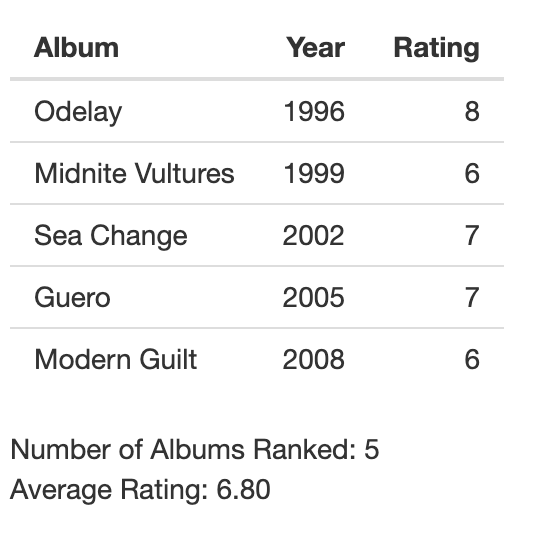

# Bands and Artists

This guide explains how to navigate the MyFavoriteAlbums user interface. Either go to [https://cholstro.shinyapps.io/shiny-music/](https://cholstro.shinyapps.io/shiny-music/) to view the user interface with the default data or follow the [Inserting your own data](inserting.md) section of this guide to use MyFavoriteAlbums with your own album data.

The Bands and Artists feature allows you to view all of your ranked albums for one artist.

1. Click on the **Bands and Artists** tab from the top menu.  
2. Choose a band or artist to view by typing into the **Choose a band or artist** drop down menu or by scrolling to find the desired artist. The table now displays all ranked albums from the artist.  

   