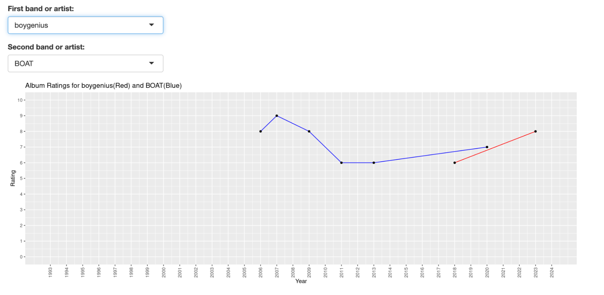

# Band Comparison

This guide explains how to navigate the MyFavoriteAlbums user interface. Either go to [https://cholstro.shinyapps.io/shiny-music/](https://cholstro.shinyapps.io/shiny-music/) to view the user interface with the default data or follow the [Inserting your own data](inserting.md) section of this guide to use MyFavoriteAlbums with your own album data.

The Band Comparison feature allows you to view a chart of how two of your favorite bands’ albums have ranked throughout time.

1. Click on the **Band Comparison** tab from the top menu bar.  
2. Choose a band or artist by typing or scrolling in the **First band or artist** drop down menu.  
3. Repeat step 2 for a second band or artist. The website now displays a graph showing the ranking of all albums from each band.  

