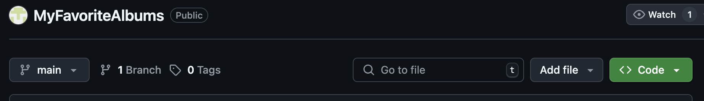
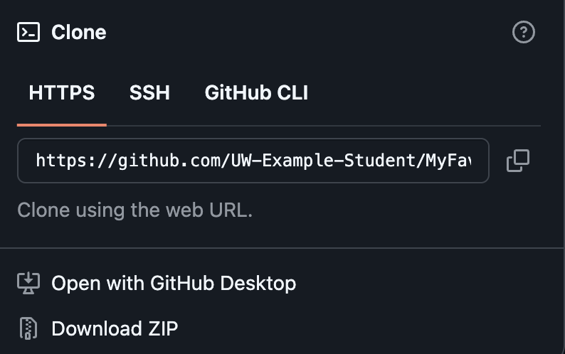

# Downloading My Favorite Albums

This section explains how to download the source code for My Favorite Albums. Once downloaded you can begin to insert your own data.

1. Go to [https://github.com/UW-Example-Student/MyFavoriteAlbums/tree/main](https://github.com/UW-Example-Student/MyFavoriteAlbums/tree/main)  
2. Press the drop down on the green code button  

    
3. Press **Download ZIP** to download the compressed folder to your computer.  

    
4. Unzip the MyFavoriteAlbums-main.zip file within your downloads folder.