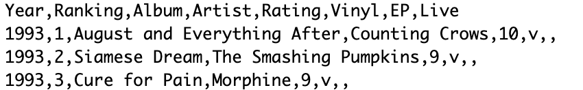

# FAQs

## Do I need programming experience to work with My Favorite Albums?

No\! My Favorite Albums does not require any previous programming experience to work with. Anybody with the required software can use my favorite albums, see [prerequisite downloads](prereq.md) for more information. For directions on how to use My Favorite Albums see tutorials.

## Can I input my own data into my favorite albums?

Yes. My Favorite Albums allows users to visualize their own data by editing the **album-ranking.csv** file which contains all the data used by My Favorite Albums. See [Inserting Your own Data](inserting.md) for more information.

## What software do I need to download to use My Favorite Albums?

To run My Favorite Albums you need to download R, R Studio, and My Favorite Albums. See How to Get Started for more information on prerequisite downloads. For information on downloading My Favorite Albums, see Downloading My Favorite Albums. In the process of running My Favorite Albums with your own data you may be prompted to install R packages, these packages come included with the R/Rstudio download, and instructions for installing these packages are included in the Viewing Your Data in Action section. 

## Can I build on top of My Favorite Albums?

Yes, My Favorite Albums serves as an excellent starting point to implement advanced functionality for experienced R developers. See [Building on Top of My Favorite Albums](building.md) for some ideas to get you started. The [API reference](api.md) is also an excellent reference to aid in working with My Favorite Albums base functionality.

## How is the dataset formatted?

**Warning: The first line of album-rankings.csv MUST remain unedited or else My Favorite Albums will not function.**

The dataset \`album-rankings.csv\` is a comma-separated value file. Each line represents a row (one album). Within each row each column entry is separated by a comma. The rows are first sorted by year, with albums with the oldest year first, and then within albums from the same year sorted by ranking, with the highest ranked album first. Below is a list of the columns:

* **Year**: the year of the album.  
* **Ranking**: a number representing how the user ranks the album compared to other albums in the same year (1 being the highest).  
* **Album**: the album title.  
* **Artist**: the band/artist name.  
* **Rating**: a number from 1-10 representing the users how much the user enjoyed the album, 10 being the highest.  
* **Vinyl**: either v or empty. v signifies that the user owns the album.  
* **EP**: either EP or empty. EP signifies that the album is an EP.

After the EP column a comma is required. A sample of the dataset (lines 1-4) is seen below:

  
The first line tells R the title of each column. 

