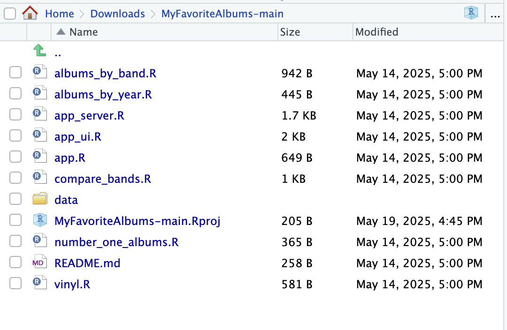
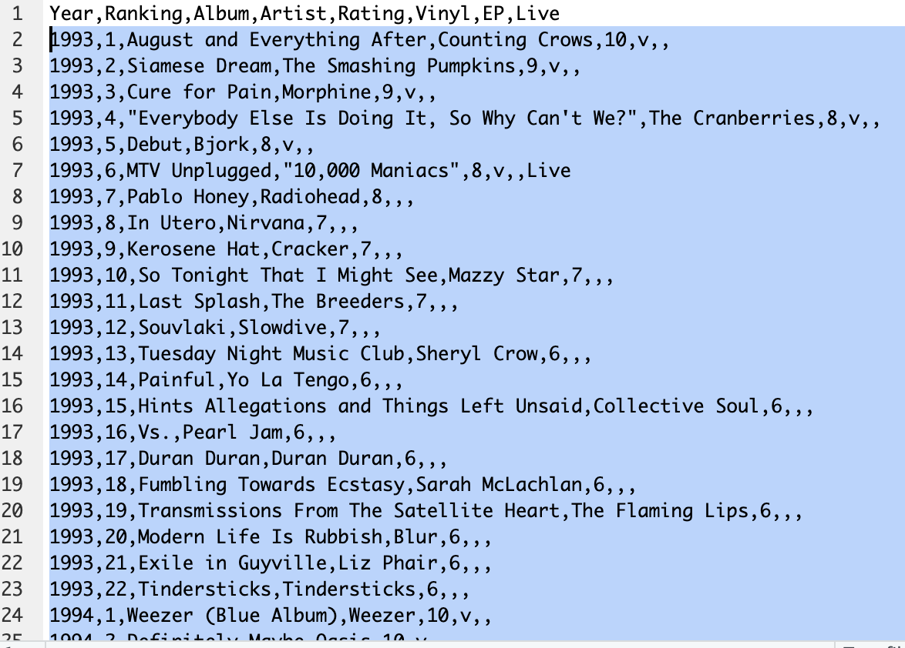

# Inserting your own data into My Favorite Albums

This tutorial assumes that you have R, RStudio, and My Favorite Albums downloaded. See [prerequisite downloads](prereq.md) if you do not.

1. Within the R Studio app, open the My Favorite Albums project by clicking on **File \-\> Open Project** in the top menu and selecting the downloaded and unzipped **MyFavoriteAlbums-main** folder.  
2. In the bottom right pane there should be a file viewer, click on the **data** folder and then click on **album-rankings.csv.** 

   
 
   If this file viewer is not in the bottom right of your window, click on **File \-\> Open File \-\> data \-\> album-rankings.csv** in the top menu.  
     
**Warning: The first line of album-rankings.csv MUST remain unedited or else My Favorite Albums will not function.**

3. To work with only your data, delete all but the first line of the album-rankings.csv file which is visible in the top left. **See [How is the dataset formatted?](formatted.md) for crucial information regarding the required formatting for album-rankings.csv.**
 
  
4. Start inserting albums you have listened to by following the format outlined in the first line (and in How is the dataset formatted?), separating each field with a comma. Make sure that each album occupies one row. See Comma Separated Values for more information on csv files in general.

You now have updated CSV album data to be used as your data source. **You must publish your version of My Favorite Albums**. See [Using My Favorite Albums Locally](locally.md) for information on how to publish to your own machine, or see [Using My Favorite Albums on the Internet](internet.md) for information on how to publish to the web. For more information on the formatting of album-rankings.csv, see [How is the dataset formatted?](formatted.md).
