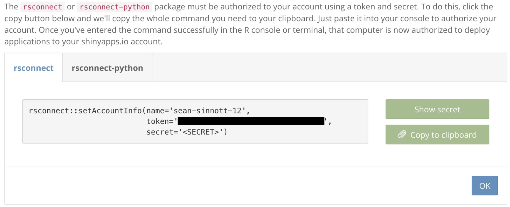
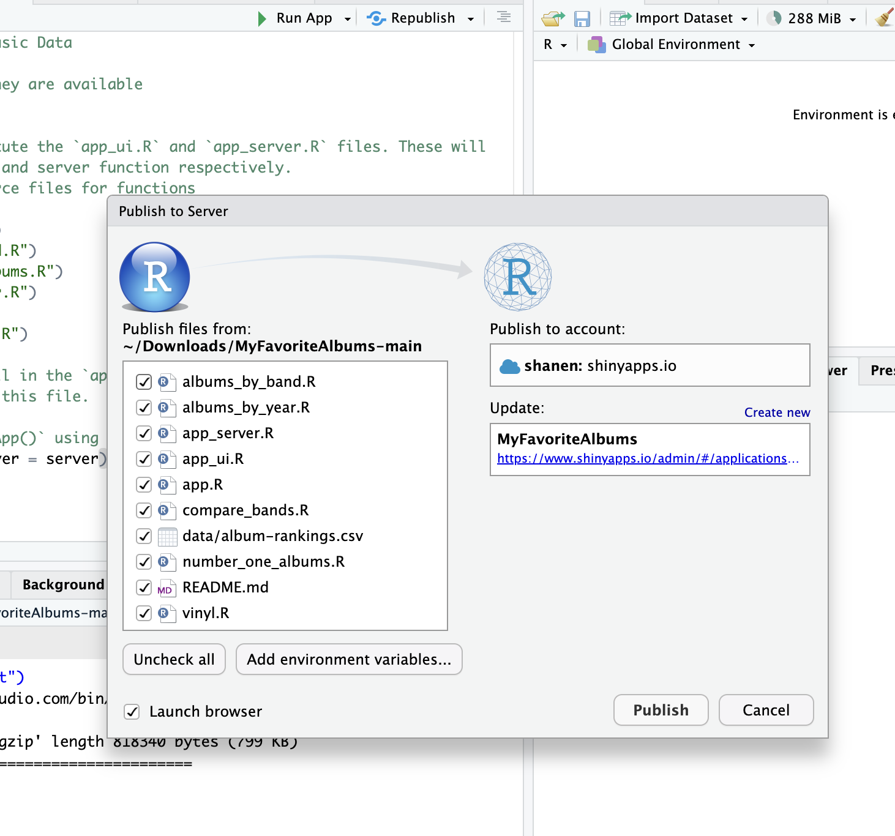

# Using My Favorite Albums on the internet

This tutorial assumes that you have the My Favorite Albums package open in R Studio, and have updated album-rankings.csv with your own data (although it will work with the default data). See the inserting your own data section for these prerequisite steps. 

Running My Favorite Albums on the internet allows you to view the app over the internet from any machine. Running My Favorite Albums on the internet will allow you to view the app outside of RStudio as well as let others view your data. If you only want to view the app locally through RStudio see Using My Favorite Albums locally.

1. Go to [shinyapps.io](http://shinyapps.io) and create an account.  
2. Install the rsconnect package by typing **install.packages('rsconnect')** into your RStudio console and pressing enter.  
3. On the [shinyapps.io](http://shinyapps.io) page in your browser, press **Copy to clipboard.**  
   
     
4. Copy your account setup information from step 3 into the RStudio console and press enter once in the console.  
     
5. Press publish in the script window menu. (R Studio will say “Publish” if you have not published My Favorite Apps before instead of “Republish”)  
   
       
6. Press publish. R Studio will begin the process of publishing the app. When this process is complete R studio will open the app in your browser. RStudio will now say ‘republish’ rather than ‘publish’ if the process has succeeded.  
7. You can manage your publications by going to [https://www.shinyapps.io/admin/\#/applications/all](https://www.shinyapps.io/admin/#/applications/all). From this website you should be able to retrieve the URL for your MyFavoriteAlbums in case you lose it.

You can now access your version of My Favorite Albums from any machine by visiting the URL found on [https://www.shinyapps.io/admin/\#/applications/all](https://www.shinyapps.io/admin/#/applications/all).
