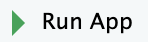

# Using My Favorite Albums locally

This tutorial assumes that you have the My Favorite Albums package open in R Studio, and have updated album-rankings.csv with your own data (although it will work with the default data). See the inserting your own data section for these prerequisite steps. 

Running My Favorite Albums locally allows you to view the app in action in RStudio on your own machine. Running My Favorite Albums on the internet will allow you to view the app outside of RStudio as well as let others view your data. See Using My Favorite Albums on the internet for information on how to publish the app to the internet.

1. Within the R Studio app, open the my favorite albums project by clicking on **File \-\> Open Project** in the top menu and select the downloaded and unzipped **MyFavoriteAlbums-main** folder.  
2. Open app.R by clicking **File \-\> Open File \-\> app.R** in the top menu or by clicking app.R in the file navigator pane in the bottom right of the screen.  
3. Click   in the menu above the script viewer.   
   1. If you are prompted to download uninstalled packages in the console, resolve these errors by typing **install.packages(“*\<package name\>*”)** in the console and pressing enter. (Replace \<package name\> with the required package)  
   2. Repress **Run App** and repeat step 3a) until all necessary packages are downloaded.

RStudio opens My Favorite Albums locally. For information on how to use the app, see Navigating the User Interface.