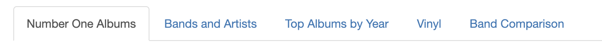
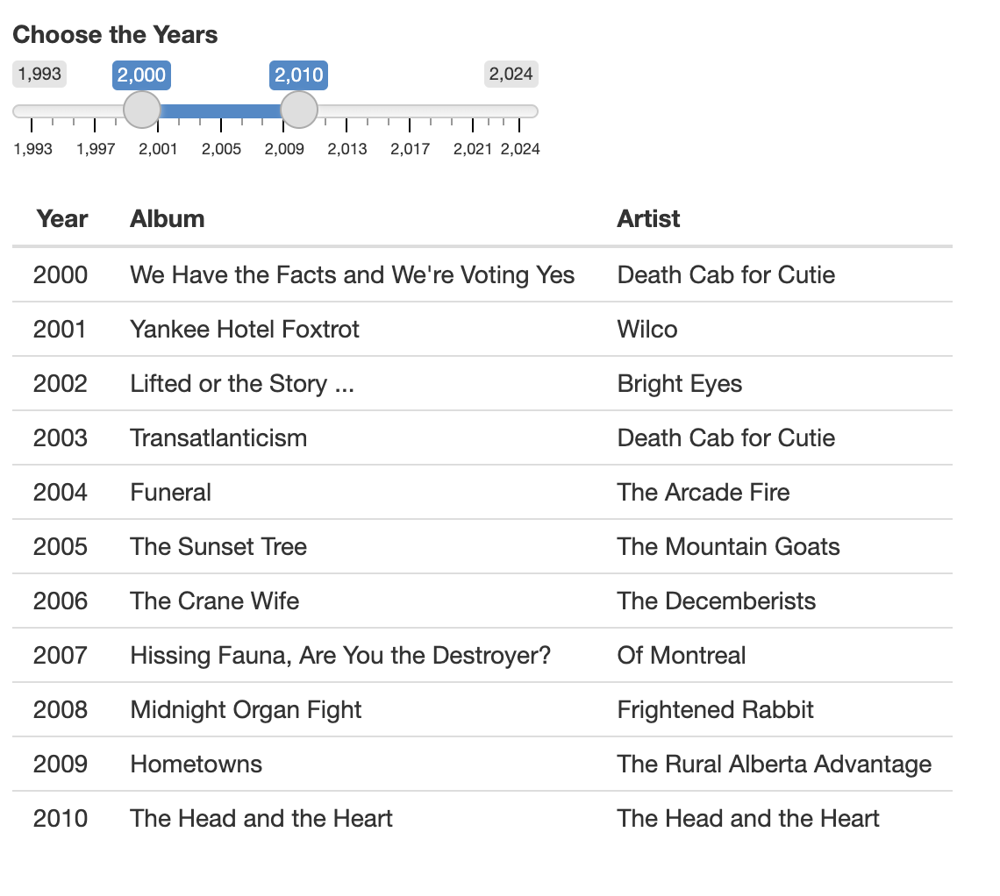

# My Favorite Albums

This guide explains how to navigate the MyFavoriteAlbums user interface. Either go to [https://cholstro.shinyapps.io/shiny-music/](https://cholstro.shinyapps.io/shiny-music/) to view the user interface with the default data or follow the [Inserting your own data](inserting.md) section of this guide to use MyFavoriteAlbums with your own album data.

The My Favorite Albums feature allows you to view your \#1 ranked albums from a range of years.

1. Click on the **Number One Albums** tab from the top menu.

  

2. Change the date range for the data by moving the sliders to your desired range. The table displays your top ranked album from every year in the range.  
  
 